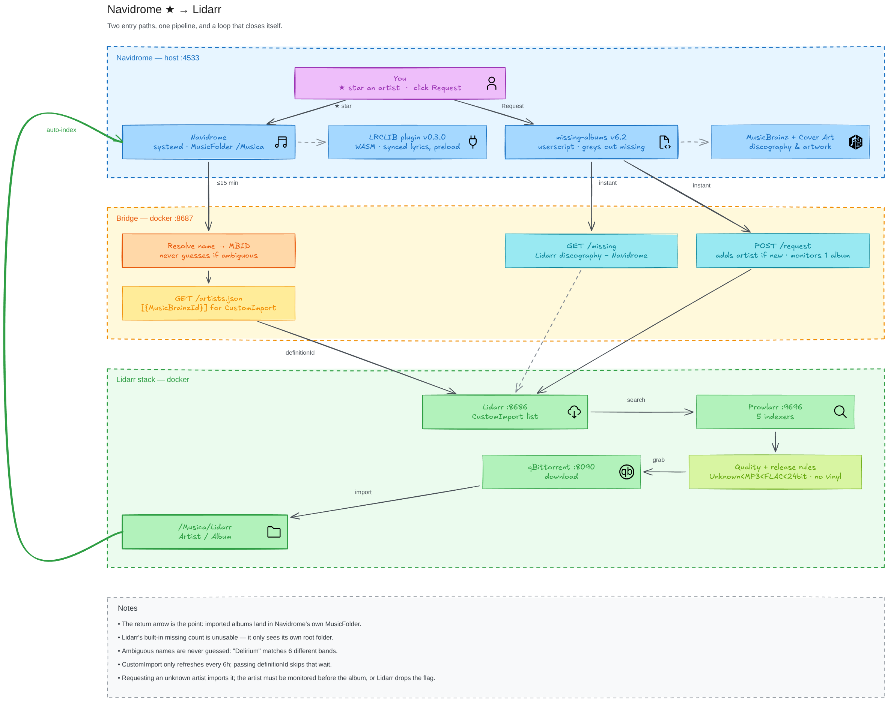

# navidrome-lidarr-bridge

Star an artist in Navidrome and Lidarr starts monitoring them. Open an artist
page and the albums you are missing appear greyed out in the grid, each with a
button that asks Lidarr to go find it.



The loop closes on its own: what Lidarr imports lands inside Navidrome's own
music folder, so the album is indexed and stops being missing without anyone
touching anything.

## Quick start

1. Copy `.env.example` to `.env` and fill in the Navidrome credentials and the
   Lidarr API key.
2. Add the service to the compose file that already runs Lidarr — see
   `docker-compose.example.yml` — and bring it up.
3. In Lidarr, add an import list of type **Custom List** pointing at
   `http://navidrome-lidarr-bridge:8687/artists.json`, with the quality profile
   and root folder you want new artists to use.
4. Install a panel in Navidrome — see
   [The panel inside Navidrome](#the-panel-inside-navidrome).

Star an artist and it appears in Lidarr within `REFRESH_SECONDS`.

## Why a name→id lookup step

Lidarr's `CustomImport` accepts only MusicBrainz ids:

```json
[{"MusicBrainzId": "24e1b53c-3085-4581-8472-0b0088d2508c"}]
```

Libraries tagged without MusicBrainz fields therefore need every starred artist
resolved by name first. The bridge asks Lidarr's own `/api/v1/artist/lookup`,
so the id it emits is exactly the one Lidarr uses when adding the artist.

## Ambiguity is settled by the library, not by a coin toss

Ten different artists are called "Delirium". Picking the first would silently
monitor the wrong discography, and asking the user to pick is just handing the
problem back.

But unrelated bands sharing a name do not share a back catalogue. Holding
`Abismo` and `Los signos del Fauno` identifies exactly one of those ten — the
Honduran metal band — and nothing else comes close. So each candidate's
discography is fetched from MusicBrainz and compared against what the library
already holds; the one that overlaps wins.

**Being the only match is not the same as being the right band.** That check
first ran only when several artists shared a name, so a single match was taken
on trust — and exactly one artist in MusicBrainz is called "Nihilismo", a punk
band that shares not one album with the four under that name here. It was
accepted without question and the panel offered eight of its records.

A lone candidate is now checked like any other. The check is a veto rather than
a requirement: a catalogue that cannot be read, or that lists nothing at all,
proves nothing and lets the match stand, because an artist MusicBrainz happens
not to cover must not stop resolving.

Titles are compared with one rule, in one place. When identification and the
missing list answered "does the library have this?" differently, `Raping Uranus`
in the catalogue and `Raping Uranus: The Lost Tracks Of Alien Fucker` on disk
counted as owned by one and unknown to the other — and that artist, correctly
matched, read as a stranger.

A tie is not an answer either: if two catalogues match equally well, the library
cannot tell them apart, and the name is left unresolved. So is a name where
nothing matches at all, and one that everything contradicts. Those appear on
`/status` with every candidate and what each had in common, so the pin is an
informed one:

```json
{
  "unresolved": {
    "Delirium": {
      "reason": "ambiguous: 6 artists share this name",
      "candidates": [
        {"mbid": "03a6ea55-...", "disambiguation": "Italian progressive rock band"},
        {"mbid": "a76754ec-...", "disambiguation": "Dutch punk band"}
      ]
    }
  }
}
```

Pin the right one in `overrides.json` inside the state volume:

```json
{"Delirium": "03a6ea55-25e8-4d03-a98b-ba0f2ccb4ca5"}
```

Overrides are merged when the feed is published and never written into
`resolved.json`, so editing or deleting an entry takes effect on the next sync.
A value that is not a MusicBrainz id is refused and reported on `/status`
instead of being handed to Lidarr.

A name that cannot be resolved is retried with exponential backoff (starting at
`REFRESH_SECONDS`, capped by `MAX_BACKOFF_SECONDS`) rather than on every pass,
because `/artist/lookup` reaches the rate-limited `api.lidarr.audio`. When
Navidrome already carries a MusicBrainz tag for a starred artist, the bridge
uses it directly and skips the lookup entirely.

## Pushing the change to Lidarr

`CustomImport` declares `MinRefreshInterval = 6h`, so the scheduled
`ImportListSync` reads the list at most every six hours no matter how often it
runs — star an artist and it sits there, with Lidarr logging `No list items to
process` while the feed already serves it.

So whenever the published set changes, the bridge posts an `ImportListSync`
command carrying `definitionId`. That takes Lidarr's single-list path, which
fetches immediately instead of consulting the interval.

The set it last pushed is persisted, so a restart is not mistaken for a change.
A push that fails is logged and reported on `/status` but never fails the sync:
Lidarr still picks the change up on its own six-hour refresh.

## Endpoints

| Path              | Purpose                                             | Status                                |
|-------------------|-----------------------------------------------------|---------------------------------------|
| `/artists.json`   | the list Lidarr consumes (also served at `/`)       | `503` until the first successful sync |
| `/status`         | last sync, counts, unresolved names + candidates    | `503` when the last sync failed       |
| `/sync`           | force a refresh now (`GET` or `POST`)               | `500` if that refresh fails           |
| `/missing?id=`    | albums an artist is missing, by Navidrome artist id | `502` if either service is unreachable |
| `/request`        | `POST {"albumId"\|"mbid"}` — monitor it and search   | `404` if Lidarr has no such album     |
| `/panel.user.js`  | the userscript that draws the panel in Navidrome    | `404` if the file is missing          |

`/request` takes either a Lidarr album id or a MusicBrainz release-group id.
Lidarr stores that release-group id as `foreignAlbumId`, so a caller that
already speaks MusicBrainz — as any MusicBrainz-driven panel does — needs no
translation step.

An album whose artist Lidarr has never imported is still requestable: Lidarr
resolves a release-group id to its artist even for artists it does not hold, so
the bridge imports that artist and carries on rather than sending the caller
away to add it first. The artist is added with `monitor: none`, and only the one
album that was actually asked for is then monitored — added the usual way, a
single click would queue the entire discography.

That last step has an order to it. Lidarr accepts a write monitoring an album
whose artist is unmonitored, and then silently drops the flag, so the artist has
to be monitored first. Profiles and root folder for the new artist are read from
the import list, so a requested artist lands exactly where a starred one would.

## The panel inside Navidrome

Navidrome exposes no UI extension point — the eight plugin capabilities are
metadata, lifecycle, lyrics, scheduler, scrobbler, sonicsimilarity, taskworker
and websocket, and none of them renders anything. `ui/src/plugin/` is the admin
screen *for* plugins, not an extension point. So the panel is injected, and
there are two ways to do it.

**A userscript.** [navidrome-missing-albums-userscript][mau] reads the full
discography from MusicBrainz, greys out the albums you do not have inside
Navidrome's own grid, and puts a request button over each cover — it probes this
bridge and only draws the button when it answers. Install it in Tampermonkey or
Violentmonkey; it self-updates. The `/panel.user.js` served by this bridge is a
simpler alternative that draws a floating card instead.

[mau]: https://github.com/danielbanariba/navidrome-missing-albums-userscript

**An nginx front.** `nginx/navidrome-panel.conf` proxies Navidrome and injects
the panel into the HTML with `sub_filter`, so every browser and phone gets it
with nothing installed. Navidrome keeps serving its own port untouched.

Both draw over the page rather than into it: Navidrome is a React app and would
drop an injected child on its next render. The userscript hangs its button on
the tile wrapper rather than the cover container, because that container carries
`grayscale` and reduced `opacity` and children inherit both — the cover is meant
to look faded, the button is not.

### Discogs decides what the discography is

Lidarr can only ever act on what MusicBrainz knows, because every id it stores
is a MusicBrainz id. That does not make MusicBrainz the authority on what a band
released. For one Honduran metal band here, MusicBrainz lists seven albums and
Discogs lists ten — including the 2017 record already sitting in the library.

So the missing list is Lidarr's catalogue, widened by whatever Discogs adds.
Anything only Discogs knows is marked `requestable: false`: Lidarr has no id for
it and cannot fetch it, but a record you did not know existed is worth naming
even when nothing can go and get it.

Finding the artist on Discogs is the same trick as before, and it works better
there. Discogs lists 326 artists called "Delirium", so asking by name is
hopeless — but asking for one of their records is not. A release title that
returns a single hit has identified the band, because no other band by that name
put out a record by that title.

Read access needs no OAuth: key and secret go in a header, which also lifts the
rate limit from 25 requests a minute to 60. Both are optional.

### Why "missing" is not Lidarr's own count

Lidarr only sees its own root folder. A library organised anywhere else reads
as entirely missing — for one artist here Lidarr reported 13 missing albums
while 11 of them sat in the library in FLAC. So `/missing` diffs Lidarr's
discography against what Navidrome actually holds, and Navidrome wins.

Titles are compared with case, punctuation and parenthesised edition notes
stripped, since one side reports file tags and the other reports MusicBrainz.
That also collapses a `(Live)` variant onto the studio album of the same name,
which can hide a live release — the safe direction, since the cost is a missing
suggestion rather than re-downloading something already owned.

`/artists.json` answers `503` rather than an empty `200` while Navidrome has
never been reached: an empty list means "nothing is starred", which is a very
different statement from "the source is down". `/status` drives the container
`HEALTHCHECK`, so a service whose syncs keep failing reports `unhealthy`
instead of looking fine forever.

## Ending the guesswork: `tools/tag-mbids.py`

Every part of this works out which band a folder belongs to by comparing names,
and each part guesses separately. An id in the file ends the argument.

`tag-mbids.py` writes the MusicBrainz artist, album-artist and release-group ids
into an artist's files, using the Picard tag names Navidrome's `mappings.yaml`
already lists as aliases. Navidrome then reports the id over Subsonic and the
bridge skips name resolution entirely — exact, and free.

It also settles the names no catalogue will ever match, because the library
spells them its own way: `AC-DC` is never going to find `AC/DC` by asking.

```
tools/tag-mbids.py --artist <navidrome-artist-id>            # print a plan
tools/tag-mbids.py --artist <navidrome-artist-id> --apply    # write it
```

Paths come from Navidrome's own API rather than Subsonic's. The Subsonic `path`
is synthesised from tags — `Delirium/Abismo/01 - …` for a file that lives four
directories deeper under a genre tree — so joining it to the music folder yields
a path that does not exist.

## When the catalogue has never heard of the band: `tools/metal-archives-seed.py`

Lidarr is keyed entirely on MusicBrainz ids. A band MusicBrainz does not have
cannot be imported, monitored or requested, and the panel can only say — quite
correctly — that it knows nothing. For underground metal that is most of the
shelf. One Honduran black metal band here has three records and a split
documented in full on Encyclopaedia Metallum, and is absent from both
MusicBrainz and Discogs.

Reading a third catalogue would not fix that. It would only let the panel name a
record nothing can go and fetch, which is what `requestable: false` already does
for anything only Discogs knows. The fix is to put the band in the catalogue the
pipeline already speaks — once — after which every part of this starts working on
its own, and the next person looking for that record finds it too.

```
tools/metal-archives-seed.py --artist <navidrome-artist-id>
tools/metal-archives-seed.py --unresolved      # every name the bridge gave up on
```

It gathers what Metal Archives holds, times each track against the file actually
on disk, and writes a page of MusicBrainz forms with every field filled in.
Nothing is submitted from here: a person reviews each form and presses the
button. That is the point — this does the transcription, not the judgement.

`--unresolved` reads the bridge's own `/status`, so the list of names it works on
is exactly the list of names the library could not answer.

Which band is settled the way it is settled everywhere else here. Sixty-seven
bands are called "Delirium" on Metal Archives, so the one whose discography
matches the library wins, a tie is refused, and a name nothing confirms is left
alone rather than guessed at.

Splits are left out on purpose: they need a credit per track, and a half-seeded
form is worse than an empty one. So is anything with no track list to copy. Both
are named on the page rather than silently dropped.

One warning the page repeats, because it is the whole reason this project exists:
MusicBrainz will offer to match by name, and there is already an unrelated punk
band called Nihilismo in it. Create the artist first, paste its id, and every
form credits the right band.

## Judging a release by what is inside it: `tools/best-release.py`

Lidarr can only act on what a release calls itself. Of ten torrents for one
album here, not one named its format, so every one was classified `Unknown` —
ranked below the MP3 already held, and therefore never taken as an upgrade. That
is the right call from Lidarr: it cannot prove any of them is better. The one
with 39 seeders was MP3.

The only way to know what a release is, is to look. `best-release.py` auditions
several candidates at once and keeps the best, checking cheapest first:

1. **The torrent's own file list**, which costs no download at all and rules out
   everything carrying no lossless file.
2. **The audio streams** of whatever survives: codec, bit depth, sample rate.
3. **The spectrum**, because a FLAC decoded from an MP3 is still an MP3 — it
   just weighs more. A 24-bit file padded up from 16-bit is the same lie told
   about depth, and the bottom eight bits give that one away.

```
tools/best-release.py --album-id 58                # free pass: look, download nothing
tools/best-release.py --album-id 58 --download     # audition for real
```

The verdict is per album, not per track: one odd file does not decide a record.
What the library already holds competes on the same terms, so an audition that
finds nothing better says so instead of fetching a copy that changes nothing.
Losers are deleted and the winner is handed to Lidarr, which imports it the
ordinary way. Only torrents carrying this tool's own tag are ever deleted.

### Why the spectrum is measured as a cliff

A first attempt compared each track's high frequencies against its loudest bin.
That bin is always bass, forty to sixty decibels up, so every honest record read
as cut off around 17 kHz — including a known 320 kbps file whose real shelf is
at 20.5.

What an encoder leaves behind is a step, not a level: the spectrum runs along,
falls off a wall, and stays down. Measured that way against files of known
provenance:

| known file    | drop  | verdict           |
|---------------|-------|-------------------|
| MP3 320 CBR   | 57 dB | encoder lowpass   |
| MP3 V0        | 12 dB | gentler rolloff   |
| FLAC 16/44    | 13 dB | genuine           |
| FLAC 24/96    | 3 dB  | genuine           |

A V0 leaves too little wall to catch that way, so it is caught by where it stops
instead — 20.0 kHz, against 20.9 for a genuine rip of the same era. That margin
is under a kilohertz and will occasionally demote an honest but dull master. The
cost of being wrong in that direction is a choice between two lossless copies;
the cost the other way is keeping a decoded MP3 and never knowing. Every number
is printed, so the call can be overruled.

Both tools need `mutagen` and `numpy`:

```
python3 -m venv .venv && .venv/bin/pip install mutagen numpy
```

## Configuration

Copy `.env.example` to `.env` and fill in the Navidrome credentials and the
Lidarr API key. `best-release.py` also wants `PROWLARR_API_KEY`. Unstarring an artist removes them from the feed on the next
sync; Lidarr keeps artists it already added unless the list is set to remove.

## Installing the panel once and never again

`GET /userscript.js` mirrors the panel userscript from its repository and
rewrites `@updateURL` and `@downloadURL` to point back here. Install from that
address instead of from GitHub and Tampermonkey then updates itself from the
bridge, on the same origin as Navidrome — an address a shield or a blocklist
cannot quietly break, which GitHub's raw host demonstrably can.

After that the loop is: merge upstream, the bridge picks the new version up
within `USERSCRIPT_TTL`, and Tampermonkey installs it on its next check. Nothing
to copy by hand.

**`PUBLIC_SCRIPT_URL` is required behind a proxy that strips a path prefix.**
Caddy's `handle_path` and nginx's `location` both hide the prefix from the
bridge, so the `@updateURL` it derives comes out missing it — and Tampermonkey
follows that broken address without complaining, so updates simply stop. Set it
explicitly:

```
PUBLIC_SCRIPT_URL=https://navidrome.example/ndlb/userscript.js
```

## Behind a reverse proxy

Serving Navidrome under a hostname breaks two things at once: the userscript's
`@match` no longer fires, and — once the proxy terminates TLS — the page can no
longer call the bridge on plain `http://host:8687`, because a browser blocks
that as mixed content.

Mount the bridge on the same origin instead. Caddy:

```caddyfile
navidrome.example {
    handle_path /ndlb/* {
        reverse_proxy localhost:8687
    }

    reverse_proxy localhost:4533
}
```

`handle_path` strips the prefix, so `/ndlb/missing` arrives as `/missing`. The
equivalent nginx block is in `nginx/navidrome-panel.conf`.

The userscript picks the right target on its own: it uses the bridge's port only
when the page is Navidrome's own `:4533`, and the same-origin `/ndlb` prefix
everywhere else. Add the proxy host to its `@match` list.
